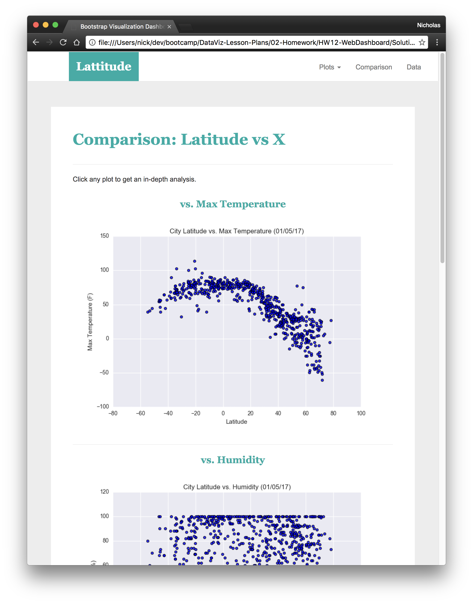
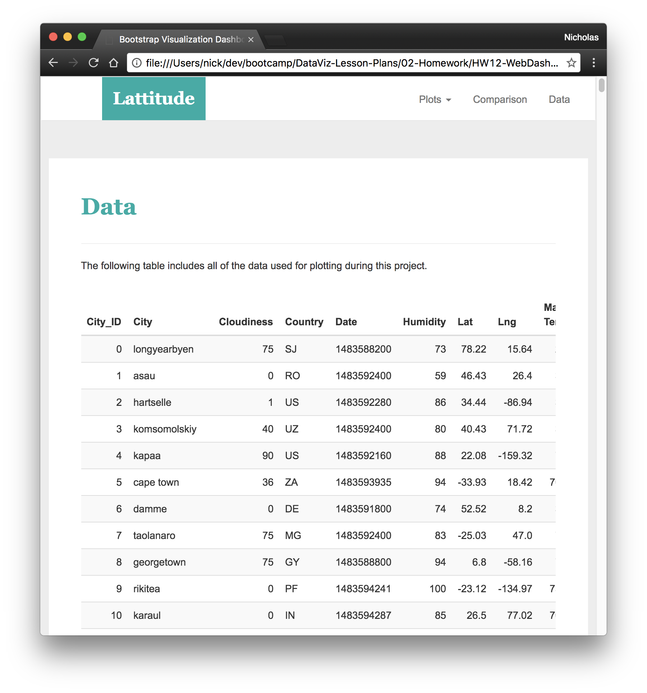
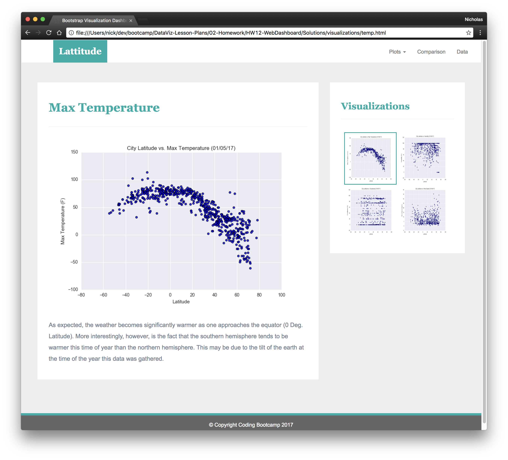

* Four [visualization pages](#visualization-pages), each with:
  * A descriptive title and heading tag.

When finished, submit to BootcampSpot the links to 1) the deployed app and 2) the GitHub repository.

### Considerations

* You may use the [weather data](Resources/cities.csv) or choose another dataset. Alternatively, you may use the included [cities dataset](Resources/cities.csv) and pull the images from the [assets folder](Resources/assets).
* You must use bootstrap. This includes using the bootstrap `navbar` component for the header on every page, the bootstrap table component for the data page, and the bootstrap grid for responsiveness on the comparison page.
* You must deploy your website to GitHub pages, with the website working on a live, publicly accessible URL as a result.
* Be sure to use a CSS media query for the navigation menu.
* Be sure your website works at all window widths/sizes.
* Feel free to take some liberty in the visual aspects, but keep the core functionality the same.

### Bonuses

* Use a different dataset! The requirements above still hold, but make it your own.
* Use a bootstrap theme to customize your website. You may use a tool like [Bootswatch](https://bootswatch.com/). Make it look snazzy, give it some attitude. If using this, be sure you also meet all of the requirements listed above.
* Add extra visualizations! The more comparisons the better, right?
* Use meaningful glyphicons next to links in the header.
* Have visualization navigation on every visualizations page with an active state. See the screenshots below.

### Screenshots

This section contains screenshots of each page that must be built, at varying screen widths. These are a guide; you can meet the requirements without having the pages look exactly like the below images.

#### Landing page

Large screen:

Small screen:



#### Comparisons page

Large screen:

Small screen:

#### Data page

Large screen:

Small screen:

#### Visualization pages

You'll build four of these, one for each visualization. Here's an example of one:

Large screen:

Small screen:

#### Navigation menu

Large screen:

Small screen:

### Copyright

Trilogy Education Services © 2019. All Rights Reserved.
